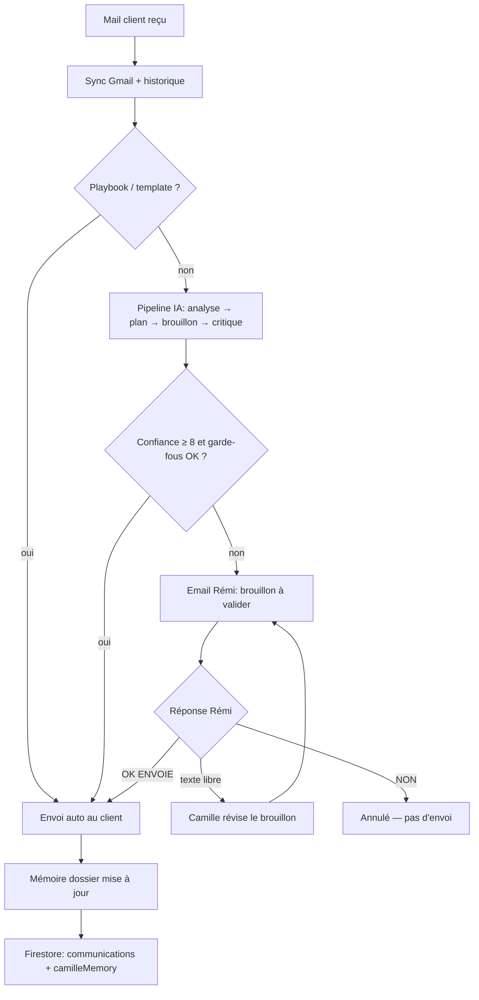

# Parcours Camille — copilote mail (Rémi = moments décisifs)

Ce document décrit le fonctionnement cible après le build `railway-camille-email-copilot-2026-05-29`.

## Principe

Vous pilotez **exclusivement par mail**. Camille lit le **fil complet** de chaque dossier et :

1. **Répond seule** aux cas routiniers (confiance élevée, playbooks, accusés réception).
2. **Propose un brouillon par email** quand elle a un doute — vous validez ou modifiez en une réponse.
3. **Vous alerte** uniquement sur les sujets décisifs (médical, juridique, réclamation, chiffrage précis).

## Schéma du flux



## Votre rôle au quotidien

| Situation | Ce que vous faites |
|-----------|-------------------|
| Rien dans la boîte `[Camille]` | Rien — Camille gère |
| Mail `[Camille] Brouillon LCIF-… — à valider` | Lire le brouillon → répondre **OK ENVOIE** ou corriger en texte |
| Mail `[Camille] Question LCIF-…` (rare) | Répondre avec votre consigne → Camille renvoie un brouillon |
| Escalade médicale / réclamation | Répondre sur le fil d'alerte ou consigne métier |

### Commandes mail (répondre au fil `[Camille]`)

- **OK ENVOIE** / **JE VALIDE** → envoi au client
- **Texte libre** (ex. « raccourcis le 2e paragraphe ») → brouillon révisé renvoyé
- **NON** / **ANNULER** → pas d'envoi

## Ce qui part automatiquement (sans vous)

- Réponses IA **confiance ≥ 8/10** + critique qualité OK + garde-fous respectés
- Accusés pièces identité / documents post-étude (templates structurels)
- Playbooks en **envoi direct** uniquement si `CAMILLE_PLAYBOOK_AUTO_SEND=true` (défaut : **false**)

Par défaut, les playbooks servent d’**inspiration** à Camille (fond + ton validés) — elle rédige une réponse adaptée au fil, pas un texte préfabriqué.

## Stockage des données (cohérence)

Tout est persisté dans **Firestore** par dossier :

| Donnée | Rôle |
|--------|------|
| `communications[]` | Fil mail client ↔ équipe (source de vérité conversation) |
| `processedGmailIds` | Mails déjà traités (pas de double réponse) |
| `camilleMemory` | Résumé narratif + sujets ouverts (injecté à chaque réponse IA) |
| `camillePendingReview` | Brouillon en attente de validation |
| `subscriptionProgress` | Phase Kereis / souscription |
| `formData.documents` + OCR | État pièces prêt |
| `camillePlaybooksStore` | Cas validés par vous → réutilisés |
| `aiAuditTrail` | Traçabilité décisions Camille |

La mémoire (`camilleMemory`) est **rafraîchie après chaque envoi** validé ou autonome.

## Variables Railway recommandées

```env
CAMILLE_REVIEW_CHANNEL="email"
CAMILLE_STAFF_REVIEW_EMAIL="remi@leclubimmobilier.fr"
CAMILLE_REVIEW_DRAFT_FIRST="true"
CAMILLE_CLIENT_MIN_SEND_CONFIDENCE="7"
CAMILLE_CLIENT_HIGH_CONFIDENCE_AUTO="8"
CAMILLE_PRODUCTION_SAFE_MODE="true"
DATA_STORE="firestore"
FIREBASE_REQUIRED="true"
```

## Après déploiement

1. Vérifier les logs boot : `build=railway-camille-email-copilot-2026-05-29`
2. Faire écrire un client test → confirmer envoi auto ou mail `[Camille] Brouillon…`
3. Répondre **OK ENVOIE** → confirmer réception côté client
4. Admin dossier : vérifier `camilleMemory` et `communications` à jour

## Limites assumées (moments décisifs = vous)

- Chiffrage / montants d'économie précis → Charles, pas Camille seule
- Nom d'assureur au client → interdit
- CNI/RIB avant accord client → bloqué par garde-fous
- Sujets médicaux, juridiques, menaces → escalade ou brouillon + vous
